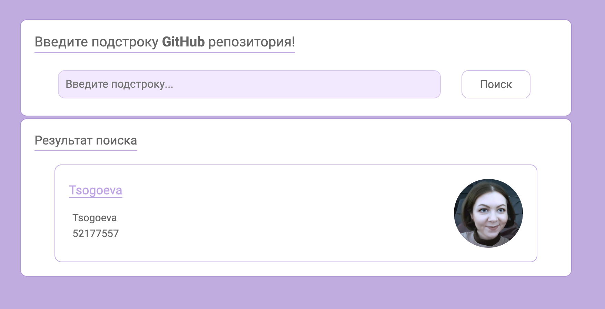
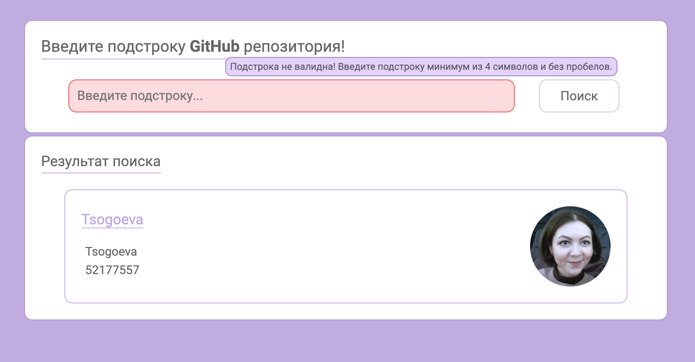
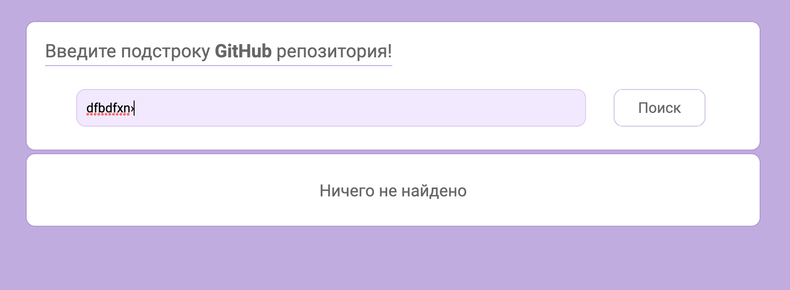

The 'GitHub' repository search box by substring
==========

------------
### Technologies:
* HTML5
* SASS
* Flexbox
* Webpack
* onChange
* MVC
* Fetch
____________

* The search returns a maximum of 10 repositories

____________

* There is validation when sending a substring

____________

* There are notifications: download, no match and error

____________

### Setup and Run:
* `npm ci`
* `npm run build`
* `npm run serve`

___________
### Refactoring:
- [ ] Add Linter
- [ ] Use more SCSS features
  - [ ] Variables
  - [ ] Expand

__________
